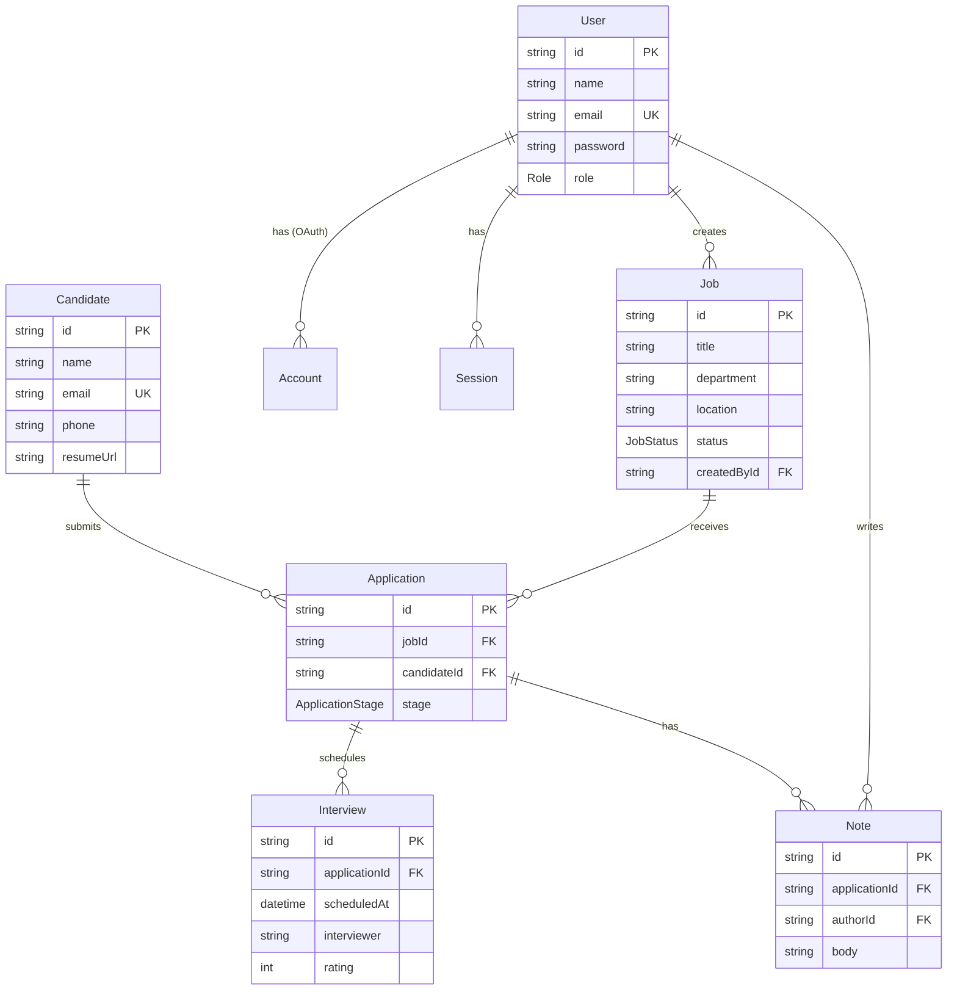

# Architecture

## Data model

HireTrack tracks jobs, candidates, and the applications that link them
together as they move through a hiring pipeline.

Key constraints:
- `Application` has a unique `[jobId, candidateId]` pair — a candidate can only
  have one active application per job (re-applying means editing the existing
  application, not creating a duplicate row).
- All foreign keys cascade on delete from the `Job`/`Candidate`/`Application`
  side, so removing a job cleans up its applications, interviews, and notes
  without leaving orphaned rows.

## Auth & authorization

Authentication uses **Auth.js (NextAuth) with the Credentials provider** and
the Prisma adapter, backed by JWT sessions:

1. On login, `authorize()` in `src/lib/auth.ts` looks up the user by email and
   compares the submitted password against the bcrypt hash stored in `User.password`.
2. On success, the user's `id` and `role` are copied onto the JWT (`jwt` callback)
   and then exposed on `session.user` (`session` callback), so every server
   component/route can read the current user's role without an extra DB call.
3. `src/middleware.ts` gates `/jobs/*`, `/applicants/*`, and `/dashboard/*` —
   unauthenticated requests are redirected to `/login` before any page or API
   handler runs.
4. API routes additionally re-check `getServerSession` server-side; the
   middleware protects pages, but mutations are never trusted on cookie
   presence alone.

## Trade-offs & decisions

- **JWT sessions over database sessions.** Simpler to run on serverless
  (Vercel) without a session store round-trip on every request. Trade-off:
  revoking a session before its expiry requires rotating `NEXTAUTH_SECRET`
  rather than deleting a row — acceptable for a trial-scale ATS, worth
  revisiting (short-lived tokens + refresh, or DB sessions) if this became a
  multi-tenant product handling real candidate PII at scale.
- **Credentials provider first, OAuth deferred.** Credentials auth needed no
  external provider setup to get a working login for the trial; `authOptions.providers`
  is structured so adding Google/GitHub OAuth later is additive, not a rewrite.
- **Candidate is a separate entity from Application.** A candidate can apply
  to multiple jobs; keeping `Candidate` global (not nested under `Job`) avoids
  duplicate candidate records and lets a future "candidate profile" view
  aggregate all of a person's applications.
- **Cascading deletes on the child side only.** Deleting a `Job` removes its
  applications/interviews/notes (expected — they're meaningless without the
  job), but deleting a `User` does *not* cascade to jobs they created, since
  historical hiring data should outlive a departed recruiter's account.
